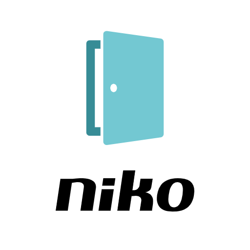

# Niko Access Control for Home Assistant

[](https://github.com/hacs/integration)
[](https://github.com/claesmathias/niko-access-control-hacs/releases)
[](LICENSE)



Integrate your **Niko Access Control** video doorbell into Home Assistant via the HikConnect cloud API (reverse-engineered from the official Niko Access Control Android app v3.0).

---

## Features

| Entity | Type | Description |
|--------|------|-------------|
| Last Call Time | Sensor (timestamp) | Date & time of the most recent doorbell ring, with full call history in attributes |
| Last Call Status | Sensor | `answered` or `missed` for the last ring |
| Total Calls | Sensor | Count of calls in the recent history (last 10) |
| Last Call Snapshot | Image | JPEG snapshot captured at the last doorbell ring |
| Online | Binary sensor | Whether the doorbell is reachable via the HikConnect cloud |
| Firmware Version | Sensor (diagnostic) | Device firmware version |
| Hardware Version | Sensor (diagnostic) | Device hardware revision |
| Model | Sensor (diagnostic) | Device model identifier |
| Serial Number | Sensor (diagnostic) | Physical device serial number |
| MAC Address | Sensor (diagnostic) | Device MAC address |
| IP Address | Sensor (diagnostic) | Local device IP address |
| Device Name | Sensor (diagnostic) | Configured device name |

---

## Supported devices

Any Niko Access Control doorbell that is registered with a HikConnect / Niko Smart Home account. Tested with:

- **Niko Access Control single-unit doorbell** (`510-31001`)

---

## Prerequisites

- A **Niko Smart Home** account (created in the Niko Access Control app)
- The doorbell already added and working in the Niko Access Control app
- Your **device serial number** (visible in the app under Menu → Info → System Information → Product number)

---

## Installation

### Via HACS (recommended)

1. Open HACS in Home Assistant
2. Go to **Integrations**
3. Click the ⋮ menu → **Custom repositories**
4. Add `https://github.com/claesmathias/niko-access-control-hacs` with category **Integration**
5. Search for **Niko Access Control** and install
6. Restart Home Assistant

### Manual

1. Copy `custom_components/niko_access_control/` to your HA `config/custom_components/` directory
2. Restart Home Assistant

---

## Configuration

1. Go to **Settings → Integrations → Add Integration**
2. Search for **Niko Access Control**
3. Fill in:
   - **Username** — your Niko Smart Home account email or phone number
   - **Password** — your account password
   - **Device Serial Number** — found in the Niko app (e.g. `F41404037`)

The integration will start polling every 30 seconds.

---

## Entities in detail

### Last Call Time (`sensor.last_call_time`)

Shows the timestamp of the most recent doorbell ring as a `datetime` sensor.

**Extra state attributes** include the full call history (last 10 calls):
```yaml
call_history:
  - calling_id: "1779652122"
    time: "2026-05-24 19:48:42"
    status: "answered"
    pic_url: "https://..."
  - calling_id: "1779459938"
    time: "2026-05-22 14:25:38"
    status: "missed"
    pic_url: "https://..."
```

### Last Call Snapshot (`image.last_call_snapshot`)

Displays the JPEG image captured by the doorbell at the time of the last ring. The image is downloaded from the HikConnect cloud and cached until a new call comes in.

### Online (`binary_sensor.online`)

Reports `on` when the HikConnect cloud can reach the device.

---

## Automation examples

### Notify on doorbell ring

```yaml
automation:
  - alias: "Doorbell notification"
    trigger:
      - platform: state
        entity_id: sensor.niko_doorbell_f41404037_last_call_time
    action:
      - service: notify.mobile_app
        data:
          title: "Someone at the door"
          message: "{{ states('sensor.niko_doorbell_f41404037_last_call_status') | capitalize }} call at {{ states('sensor.niko_doorbell_f41404037_last_call_time') }}"
```

### Show doorbell picture in notification

```yaml
automation:
  - alias: "Doorbell picture notification"
    trigger:
      - platform: state
        entity_id: sensor.niko_doorbell_f41404037_last_call_time
    action:
      - service: notify.mobile_app
        data:
          title: "Doorbell"
          message: "{{ states('sensor.niko_doorbell_f41404037_last_call_status') | capitalize }}"
          data:
            image: /api/image_proxy/image.niko_doorbell_f41404037_last_call_snapshot
```

---

## Technical notes

- This integration was reverse-engineered from the **Niko Access Control Android APK v3.0** (released 2025-11-17) using `jadx`.
- It communicates exclusively with the **HikConnect / GuardingVision cloud API** (`api.guardingvision.com` / `apiieu.hik-connect.com`).
- All API calls use `clientType: 378` (the Niko OEM app type) and `appId: NIKO`.
- Passwords are transmitted as lowercase MD5 hashes, matching `MD5Util.f()` in the APK.
- Live streaming is **not** supported — it requires the proprietary HikConnect VSDK native library which cannot run in Python.

---

## Disclaimer

This integration is not affiliated with, endorsed by, or supported by **Niko** or **Hikvision**. Use at your own risk. The API may change without notice.

---

## License

MIT License — see [LICENSE](LICENSE) for details.
